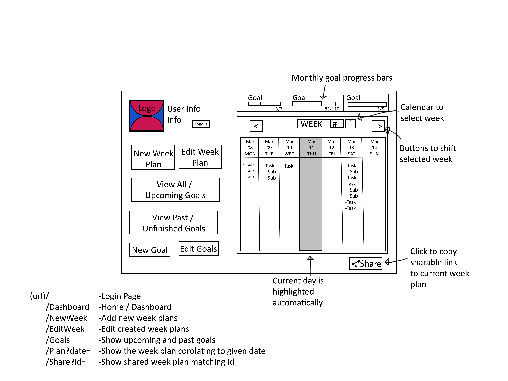

# WPD2_CourseWork
Coursework for Web Platform Development 2.

#### Commands to run application
```
npm install
node index
```

### First dashboard wireframe sketch


### Digital version of dashboard wireframe
Some changes were made from the first sketch. Notably the schedule is linked to the selected week and shows the month above the date.



Current Features:
- [x] Login / Register
- [x] Week Schedule
- [x] Adding New Workouts
- [x] Removing Workouts
- [x] Sending Form Data
- [x] Updating Page With Form Data
- [x] Marking Finished Workouts
- [x] Week Selection
- [x] Share Week Plan
